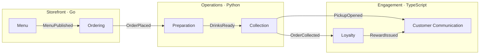
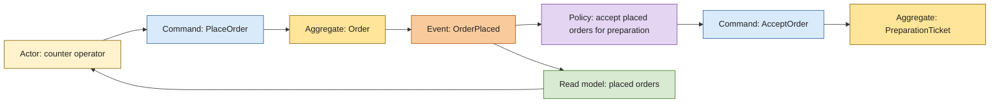

# Café architecture reference

A runnable café for learning tactical DDD, hexagonal architecture, CQRS and
reliable event-driven workflows. **Three domain microservices, three languages,
six bounded contexts**, with a separate Go API and a Next.js operator frontend.

This project builds on the original
[Bitloops `ddd-hexagonal-cqrs-es-eda` repository](https://github.com/bitloops/ddd-hexagonal-cqrs-es-eda/)
and its work explaining these architectural patterns through a runnable example.
Credit goes to **Bitloops and the original contributors** for that foundation.
The [DDD theory](#ddd-theory) and [Event Storming](#event-storming) sections below
adapt material from their README, with examples and consistency rules specific
to this café. See [credits and licence](#credits-and-licence) for sources and the
preserved upstream notice.

**One command changes one aggregate. Required asynchronous reactions use durable
handoffs, including private domain events within a context.**

| Application | Language | Responsibility |
| --- | --- | --- |
| `services/storefront` | Go | Menu and Ordering contexts |
| `services/operations` | Python | Preparation and Collection contexts |
| `services/engagement` | TypeScript | Loyalty and Customer Communication contexts |
| `services/api` | Go | Browser sessions, API routing and realtime authorisation |
| `services/web` | Next.js / TypeScript | Operator screens and Centrifugo projections |

The monorepo is organised by service. Contexts remain inside their owning
service, with idiomatic language layouts. Services exchange versioned Protobuf
contracts; they do not import one another's implementation.

Despite `es` in the repository name, this version uses **current-state
persistence**, not event-sourced aggregate reconstruction.

## Run it

Prerequisites: Docker with Compose, Python 3.13+, Node.js 24, pnpm 10.34.5 and
uv 0.12.19. Go 1.27.1 is recommended for local checks; the wrapper can use a
pinned Docker toolchain. Linux is the tested host environment.

```sh
pnpm install --frozen-lockfile
pnpm dev:up
```

Open **http://127.0.0.1:28000**. Use `OPERATOR_PASSWORD` from the ignored,
owner-readable `.local/dev.env` as the local operator access code. This is a
server-provisioned demonstration operator, not customer authentication.

Startup builds the applications and provisions PostgreSQL, RabbitMQ, Centrifugo,
separate Valkey instances for sessions and disposable realtime history, an HTTP
ingress and a local notification simulator. Next.js exports static browser assets
served by the ingress. A small internal gateway restricts realtime publication
and disconnection credentials. Each context has its own database, migration
history and restricted database/broker credentials.

In the browser:

1. Create and publish a drink.
2. Create an edition, add an offer, then publish the menu.
3. Start an order, add a drink and place it.
4. Start preparation, mark the drinks ready, then collect using the displayed code.
5. Collect three orders for the same customer to earn a reward.

Open a second window to operate the preparation counter. Both windows receive
updates independently. A command response confirms its own result; subsequent
workflow steps appear through Centrifugo. An uncertain response offers an
explicit retry with the same command identity.

```sh
pnpm demo                 # Scripted six-context journey through the Go API
pnpm test:bdd             # 51 fast Gherkin scenarios across all six contexts
pnpm verify               # Architecture, both Go modules, Python and TypeScript
pnpm test:integration     # 12 infrastructure Gherkin scenarios, recovery and Chromium
pnpm test:browser         # Browser tests against the existing development stack
pnpm dev:down             # Stop development containers; preserve their data
```

| Local endpoint | Purpose |
| --- | --- |
| 28000 | Browser ingress: static Next.js assets, API and WebSocket routes |
| 28080 | Separate Go API |
| 28081 / 28082 / 28083 | Storefront / Operations / Engagement diagnostics |
| 25432 | PostgreSQL, six private databases |
| 25673 / 25674 | RabbitMQ / management |
| 28084 | Notification simulator |
| 28090 | Centrifugo administrative API, local test access only |

Published ports bind to loopback. Change ports in `.local/dev.env` before
starting if necessary.

## Follow the story



The model deliberately contrasts three relationships:

- **Drink → MenuEdition:** independent published drink revisions become frozen
  MenuOffer values. The edition owns non-empty publication, unique offer codes
  and a single currency.
- **Order → OrderLine:** lines retain identity, but the Order controls edits and
  the combined quantity invariant. Placement freezes all lines together.
- **LoyaltyAccount → Reward:** the third collection atomically earns a grant.
  A private `RewardEarned` event creates the separate Reward later. Issuance can
  be pending without losing the entitlement; redemption has its own lifecycle.

Both private domain and public integration delivery use PostgreSQL outboxes,
confirmed RabbitMQ publication, consumer receipts, bounded retries and replay.
Browser publications use a **separate Protobuf projection contract** and an
atomic realtime outbox delivered through Centrifugo.

Read the [executable Gherkin catalogue](specifications/README.md) alongside the
model. Its 63 scenarios cover business invariants, private/public event mapping,
stored rejections, duplicate business facts, concurrent commands and provider
recovery. Godog, pytest-bdd and Cucumber execute each service's own handlers;
the workflow scenarios exercise the running system through the Go API.

## DDD theory

Adapted from the original README's
[Domain Driven Design review](https://github.com/bitloops/ddd-hexagonal-cqrs-es-eda/blob/c05b2dee2ea5d74c8ad2e39d658317fd67aff988/README.md#domain-driven-design-ddd).
The café examples and transaction policies describe this implementation.

Domain-driven design starts with understanding a business domain: its language,
processes, decisions and rules. The domain model is the shared understanding
expressed in software, developed collaboratively with domain experts.

The original guide emphasises three principles:

- Focus modelling effort on the core domain and its business logic.
- Use the domain model to guide software design.
- Work with domain experts to refine the model as understanding changes.

### Strategic DDD: language and boundaries

Strategic design identifies which models are needed, where each model applies
and how they collaborate.

| Concept | Meaning | Café example |
| --- | --- | --- |
| Domain and subdomains | The business problem and its distinct areas of responsibility | Selling drinks, preparing orders, handing them over and recognising repeat customers |
| Core subdomain | A capability that differentiates the business and deserves focused modelling | For this teaching scenario, accepting and fulfilling drink orders |
| Supporting subdomain | A capability that supports the core and may need business-specific rules | The three-collection loyalty scheme |
| Generic subdomain | A capability that can often use a standard solution | Authentication and message transport |
| Ubiquitous language | Terms used consistently by domain experts, developers, tests and code within a context | “Published edition”, “placed order”, “ready pickup” and “earned grant” have precise meanings |
| Bounded context | The boundary within which a particular model and language apply | Ordering owns the commercial Order; Preparation owns a PreparationTicket describing work to perform |
| Context map | The relationships, contracts and ownership between contexts | Ordering publishes OrderPlaced; Preparation translates it into its own ticket model |

Subdomain classification depends on business strategy; these classifications
serve the example. A subdomain describes a business problem, whereas a bounded
context defines a model boundary. A microservice is a deployment boundary.
This repository deliberately puts two bounded contexts inside each domain
microservice without merging their models or database authority.

### Tactical DDD: implementing the model

Tactical patterns express the model and enforce its rules inside a context.

| Pattern | Meaning and application here |
| --- | --- |
| Entity | An object with a stable identity and lifecycle. An OrderLine keeps its identity when its quantity changes. |
| Value object | An immutable value defined by its attributes rather than independent identity. A MenuOffer freezes a drink revision and price inside an edition. |
| Aggregate and root | A consistency boundary controlled through one root. Order owns all OrderLine edits and the combined quantity rule. Children have no independent write repository. |
| Invariant | A condition that must hold at the relevant business transition. A MenuEdition cannot be published empty; a placed Order contains 1–5 drinks and its contents are frozen. |
| Factory | A creation operation that establishes valid initial state. Named operations such as `Pickup.open` and `Reward.issue` make creation rules explicit. |
| Domain service | Business behaviour that does not naturally belong to one entity or value object. Introduce one when the model needs it; it is not a reason to synchronously update several aggregates. |
| Domain error | An explicit business rejection, such as an incorrect collection code or expired reward. It is distinct from a database outage. |
| Repository | An abstraction for retrieving and persisting aggregate state. Here, command ports bind persistence to one aggregate kind and target, including the atomic receipt/outbox boundary. |
| Domain event | A fact expressed in the context's own language. RewardEarned permits a later reaction inside Loyalty without making Reward part of LoyaltyAccount. |
| Integration event | A versioned published contract for other contexts. RewardIssued carries interoperable data rather than a live domain object. |

The application layer connects the model to use cases:

- **Commands** express intent, such as PlaceOrder. They may succeed, be rejected
  or resolve to a previously recorded outcome on retry.
- **Queries** retrieve information without changing aggregate state.
- **Application services or handlers** coordinate loading, domain decisions and
  persistence through ports. They keep infrastructure details outside the model.
- **DTOs** carry the data needed by a use case or contract; they do not expose
  an aggregate for mutation by another context.

For this reference, one command changes at most one aggregate. If business
invariants require state to change immediately together, reconsider the aggregate
boundary. If a reaction may follow later, model it as a separate command with a
durable hand-off. The account's earned grant and the independently issued Reward
demonstrate that distinction.

### DDD, hexagonal architecture, CQRS and events

DDD shapes the business model. Hexagonal architecture keeps that model and its
application ports independent of concrete infrastructure:

- **Driving adaptors**, such as HTTP endpoints and RabbitMQ consumers, invoke
  application ports.
- **Driven adaptors**, such as PostgreSQL persistence and the notification
  provider client, implement capabilities required by the application.

Driving and driven describe the relationship to the application port, not
whether a technology is a database, user interface or message broker.

CQRS separates command and query responsibilities. It does not require different
databases for every read and write, and commands here return recorded outcomes.
Event-driven workflows connect separate decisions through published facts.
Eventual consistency allows explicit intermediate states, such as an earned
grant awaiting issuance, while durable delivery and idempotent handlers allow
the workflow to converge after recoverable failures.

Domain facts that need delivery and integration events use the same durable
PostgreSQL/RabbitMQ mechanism. Their visibility and contracts differ. A domain
fact with no asynchronous reaction need not become a broker message.

Event sourcing is a separate persistence choice: an aggregate's authoritative
state is reconstructed from its event history. This reference stores current
state and does not implement that choice. An outbox or dead-letter replay alone
does not constitute event sourcing.

## Event Storming

Adapted from the original README's
[Event Storming review](https://github.com/bitloops/ddd-hexagonal-cqrs-es-eda/blob/c05b2dee2ea5d74c8ad2e39d658317fd67aff988/README.md#event-storming)
and its [design-process example](https://github.com/bitloops/ddd-hexagonal-cqrs-es-eda/blob/c05b2dee2ea5d74c8ad2e39d658317fd67aff988/README.md#design-process---event-storming).
The following is a café modelling exercise, not a record of a workshop already
conducted.

Event Storming brings domain experts and developers together to explore how a
business works. Participants build a shared model of events, decisions, actors,
rules and unanswered questions. The original guide describes three useful
levels of exploration; teams can revisit them as understanding improves.

### 1. Big Picture: discover what happens

Write significant business events in the past tense on orange notes. Arrange
them along a timeline, discuss alternative paths and look for changes in language
or responsibility that suggest context boundaries.

For the café, start with MenuPublished, OrderPlaced, DrinksReady, PickupOpened
and OrderCollected. The third eligible collection can lead to RewardEarned and,
later, RewardIssued. These are possible business sequences, not a guarantee of
global message ordering.

Add actors such as the counter operator and collection operator, external
systems such as the mailbox provider, and hotspots for unresolved questions.
Useful hotspots include cancellation after preparation starts, menu withdrawal,
and whether a reward's validity begins when it is earned or issued.

### 2. Process Level: connect decisions and reactions

Choose a process and add:

- **Commands**, in blue: the decisions or intentions, such as PlaceOrder.
- **Read models**, in green: information needed to decide, such as the published
  menu and current draft order.
- **Policies**, in lilac: reactions phrased as “Whenever X happens, do Y”, such
  as “Whenever an order is placed, accept it for preparation”.

Trace the actor's information needs, the command, its resulting event and the
next policy. Include rejected decisions, external failures and pending work.
A command is a request; its event records a fact that actually happened.

### 3. Design Level: locate the invariants

Explore the rules that each decision must enforce and identify the aggregate
root that owns them. The guide uses another shade of yellow for aggregates,
distinct from actor notes. Record the meaning of each colour in the workshop
legend; colours help collaboration but do not determine the architecture.

In this example:

- MenuEdition owns non-empty publication, unique offer codes and one currency.
- Order owns the combined drink quantity and freezes its child lines at placement.
- LoyaltyAccount atomically earns a grant; a policy requests issuance of a
  separate Reward afterwards.

Event clusters suggest boundaries to investigate. The immediate business
invariants determine aggregate boundaries; placing notes beside each other
does not establish a shared transaction.

### Event Storming syntax in the café

An actor or policy requests a command. An aggregate decides whether it can
perform the transition and produces facts. Events can trigger policies or
update read models, and read models inform the actor's next decision. External
systems may also supply facts that must be translated at the context boundary.



The diagram describes business relationships, not synchronous calls.
PlaceOrder commits an Order and its outgoing event; AcceptOrder runs later in
Preparation with its own transaction and receipt. Likewise, RewardEarned crosses
the durable delivery boundary even though both aggregates belong to Loyalty.

A workshop event is a modelling concept, not automatically a Protobuf message
or an event-sourcing record. Decide which facts need private domain delivery,
which become integration contracts and which only help explain local behaviour.
Use the resulting model to write invariant tests and workflow scenarios, then
refine it when new requirements reveal gaps.

## Read the reference

Start with [the walkthrough](docs/walkthrough.md), then:

- [Architecture](ARCHITECTURE.md), [tactical DDD](DDD.md) and
  [browser subscriptions](CLIENT-SUBSCRIPTIONS.md).
- Decisions for [durable delivery](docs/decisions/0001-consistency-and-delivery.md),
  [service boundaries and realtime](docs/decisions/0002-polyglot-and-browser.md),
  [executable behaviour](docs/decisions/0003-executable-behaviour.md), and
  [runtime authority and query completeness](docs/decisions/0004-runtime-authority-and-queries.md).
- [HTTP](contracts/http/README.md), [events](contracts/events/README.md) and
  [realtime contracts](contracts/realtime/README.md).
- [Testing](TESTING.md), [executed evidence](docs/verification.md),
  [Gherkin specifications](specifications/README.md),
  [contributing](CONTRIBUTING.md) and [adopting these patterns](docs/adopting-patterns.md).
- [Changelog](CHANGELOG.md) for notable changes to the reference.
- [Development secrets](docs/development-secrets.md) for protected file inputs
  and individual developer credentials.

## Deliberate scope

Only local/development configurations exist. Domain executables and the Go API
reject staging/production values. CI verifies and builds test images without
publishing releases.

This is a small operator demonstration. Payment, inventory, cancellations, menu
withdrawal, customer identity management, real email and discount application
are outside the model. Reward redemption records voucher use against an order
identity; it does not synchronously mutate or validate an Order.

List queries return complete arrays unless pagination is explicitly requested.
The browser traverses bounded pages on attachment or an unrecoverable history
gap; ordinary queries can retain their own response shape. Retention, load tests,
cluster availability and event-sourced rehydration remain outside this reference.
The generic JSONB persistence and fixed development operator are teaching
simplifications. Production identity, authorisation and operational policies
require their own design.

## Credits and licence

This reference is based on the original work in
[Bitloops `ddd-hexagonal-cqrs-es-eda`](https://github.com/bitloops/ddd-hexagonal-cqrs-es-eda/).
The DDD and Event Storming material above is adapted from its
[README](https://raw.githubusercontent.com/bitloops/ddd-hexagonal-cqrs-es-eda/refs/heads/main/README.md),
reviewed at commit `c05b2dee2ea5d74c8ad2e39d658317fd67aff988`.
The café model, multilingual service allocation and explicit transaction and
delivery rules are specific to this reference.

The original repository is MIT-licensed, copyright © 2023 Bitloops.
Its copyright and permission notice are preserved in
[THIRD_PARTY_NOTICES.md](THIRD_PARTY_NOTICES.md). This repository's licence is
available in [LICENSE](LICENSE).
