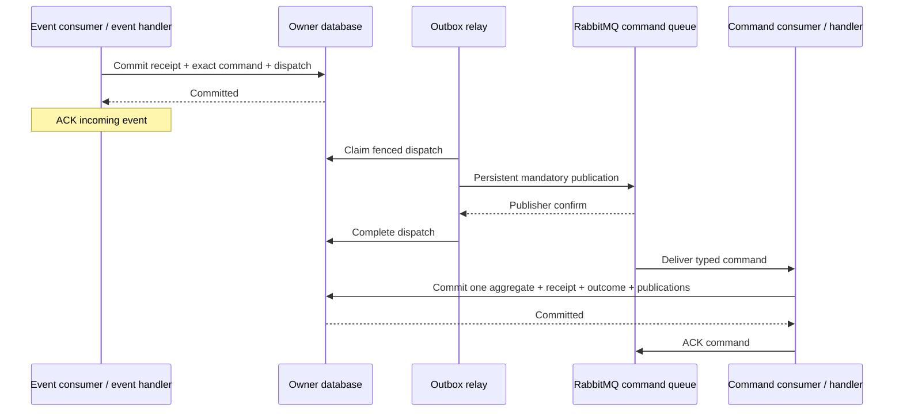

# 0011 — Durable commands before aggregate mutations

Status: accepted, 9 October 2026. Refines event handling in 0007–0009.

## Decision

Every business transition of an aggregate, including creation, is initiated by
an owner-local **command handler** receiving a named application command. The
aggregate implements invariants and the transition. A command transaction changes
at most one aggregate. Command handlers never synchronously invoke another
aggregate's command handler.

An integration event handler interprets a published fact and constructs the
receiving context's command. A private domain event handler follows the same rule
when it causes a different aggregate to change. Both depend on a
`DurableCommandPort`. Its PostgreSQL outbox adaptor records an immutable receiving
receipt, exact Protobuf command bytes and dispatch intent in one transaction.
It returns acceptance only after commit; the event consumer then acknowledges.
An outbox relay publishes the persisted bytes to RabbitMQ with persistent,
mandatory delivery and publisher confirms. Publication failures leave a fenced,
leased dispatch for recovery. The command consumer executes the application
handler and acknowledges after the aggregate, command receipt, outcome, outgoing
events and exact realtime bytes commit.

RabbitMQ is the persistent queue implementation behind application ports. Each
subscription has an owner-private command queue `ref.<consumer>.command` and
matching `.retry` and `.dead` queues on `ref.<owner>.delivery`. Quorum queues retain
commands without a request TTL. Existing common consumers supply manual ACKs,
bounded retries and confirmed transfers. Four execution attempts lead to the dead
queue; malformed messages and recorded business rejections go there directly.
Replay resets delivery attempts and preserves identities and bytes. Use
`pnpm events:replay <consumer>.command` for a command, or omit `.command` for its
source event. Owner credentials can only publish to their own delivery exchange.

The API's Protobuf command/request queues retain their RPC behaviour and required
expected versions. An unattended internal command has its own durable lifecycle.
It uses a serialised owner transaction over current state, stable business/message
identities and aggregate invariants. It has no interactive caller supplying an
expected version or waiting for a reply. Operations needing a particular revision
must carry that revision explicitly in their owner command and validate it.

## Identity, compatibility and failure semantics

The hand-off key derives from the stable subscription ID and source event ID.
The receiving record checks the original wire hash and target. A duplicate event
recovers the original persisted command; reinterpreting an already accepted event
does not overwrite it. Original event receipt material, causation and correlation
survive the hand-off. Correlation IDs never provide deduplication. Existing
business keys, including order collection and reward grant identities, retain
meaning across distinct event IDs and replay.

The command transaction also retains the original consumer receipt. Thus
operational evidence distinguishes durable acceptance (`internal_commands`) from
completed business processing (`consumer_receipts` and `command_receipts`). A
crash after event acceptance leaves a pending dispatch. A lost publication
confirmation can duplicate a command. A lost command ACK recovers the saved
outcome. Infrastructure failures roll back command work and trigger command-queue
retries. A business rejection commits its typed outcome and can be inspected in
the dead queue; blindly retrying it cannot change the recorded result.

Internal schemas live in `services/<service>/…/contexts/<owner>/adaptors/messaging/`.
They are private delivery formats, with generated files clearly under `generated/`.
Their field identities and decoders must remain compatible with stored or queued
commands during upgrades. They are separate from published versioned contracts.
`subscriptions.json` declares each owner queue identity and command type; typed
composition declarations install the two consumers together. Runtime role grants
allow immutable command/receipt insertion and fenced dispatch updates.

Projection updates, aggregate rehydration and schema/data migrations have distinct
purposes and remain explicit exceptions. Domain events stay private facts and can
travel through RabbitMQ. Queue transport alone does not make them public contracts.

## Alternatives and trade-offs

Direct aggregate mutation from an event handler is compatible with DDD and can be
transactionally safe. It has fewer moving parts and lower latency. This repository
chooses a stricter convention to make business intent, mutation entry points,
authorisation policy and failure ownership easier to find and teach.

A local command bus can synchronously return exceptions to the event consumer,
which retains retry ownership. That approach can preserve a single transaction
and is useful when both actions deliberately share one receiving unit of work.
Our event reactions span independent aggregate workflows. Durable hand-off lets
the command consumer use the same recovery model as other queued work, and avoids
placing command execution and retry orchestration in event handlers.

Publishing directly to RabbitMQ, waiting for its confirm and then acknowledging
an event is another safe at-least-once translation pattern when no local state
changes. We choose the receiving outbox because it provides durable acceptance
records, immutable mapped command bytes and the same recovery evidence as the
rest of this reference.

The extra stage costs a database transaction, persisted bytes, another queue
publication/consumption and additional latency. There are more backlogs and dead
queues to operate. Acceptance and completion become separate observations.
At-least-once delivery still requires deduplication; adding a queue cannot provide
exactly-once effects. These costs are accepted for explicit responsibility and
recoverability. The provider delivery port continues to require its stable
idempotency key for effects outside the database transaction.

## Enforcement and verification

Core imports remain independent of DI, transport and persistence. Mutation checks
inspect application access to aggregate behaviour and the aggregate command port.
Negative fixtures exercise event-handler mutation, aliases, misplaced command
execution and outward dependencies. These checks enforce the supported coding
conventions; unrestricted reflection or deliberate bypass remains a code-review
concern. Domain tests may exercise aggregates directly.

`pnpm verify` checks architecture, generated command formats, DI graphs and native
unit/type tests. `pnpm test:integration` verifies real database/broker delivery and
the complete cross-language workflow. Results and limitations are recorded in
`docs/verification.md`.
